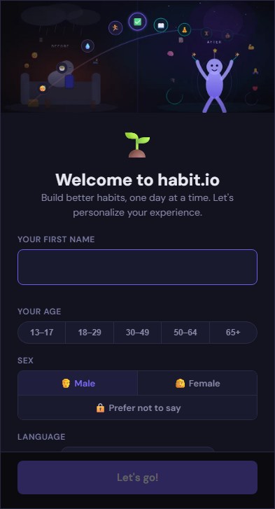
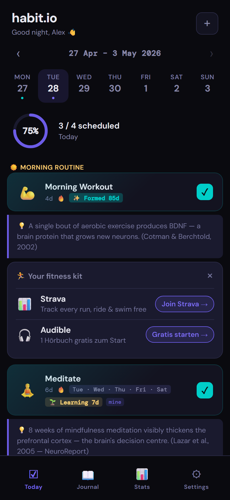
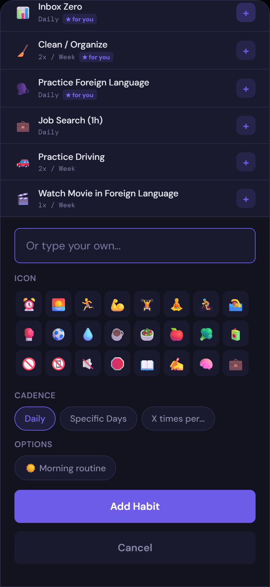
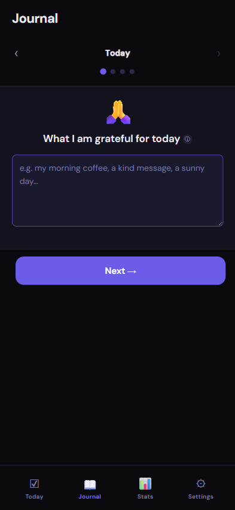
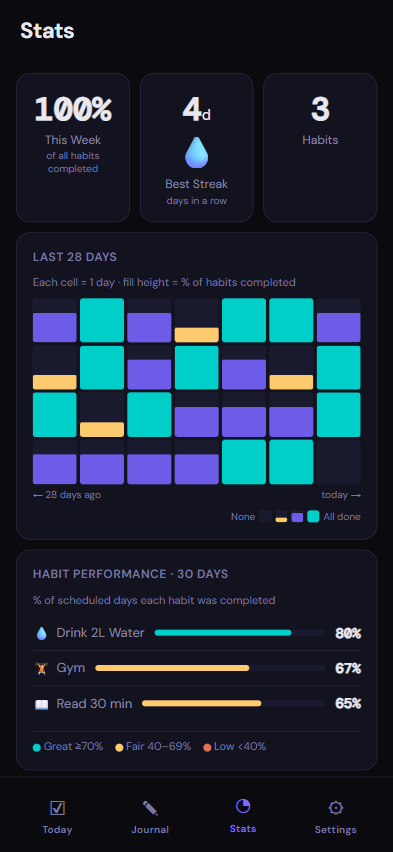
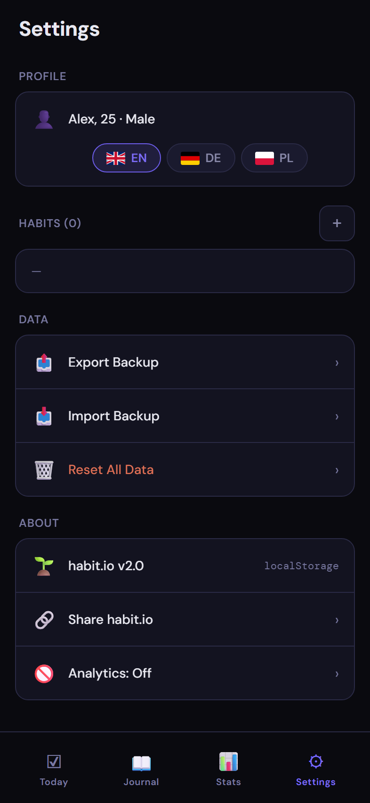

# habit.io

An offline-first PWA habit tracker — personalised by age group and sex, grounded in habit formation science. No account, no backend, no tracking.

**Live app:** https://rafalsladek.github.io/habitio/

[](https://github.com/RafalSladek/habitio/actions/workflows/ci.yml)

## Screenshots

| Onboarding | Today | Add Habit |
|:---:|:---:|:---:|
|  |  |  |

| Journal | Stats | Settings |
|:---:|:---:|:---:|
|  |  |  |

## Features

- **Personalised suggestions** — habits ranked by age group (teen / young adult / adult / midlife / senior) and sex, based on demographic research
- **Formation arc** — each habit shows its phase (🌱 Learning → 🔨 Building → ⚡ Forming → ✨ Formed) across a science-backed 66-day journey
- **Morning routine** — tag habits as morning to group and prioritise them
- **Journal** — daily prompts: gratitude, affirmations, wins, reflection
- **Stats** — streaks, weekly progress, 28-day heatmap, 30-day performance per habit
- **Offline-first PWA** — installs on home screen, works without internet
- **Export / Import** — JSON backup for cross-device migration
- **Multilingual** — 12 languages: English, Deutsch, Polski, Português, Français, Русский, हिन्दी, Українська, عربي مصري, Shqip, Srpski, Bayrisch
- **Prefer not to say** — sex option in onboarding and settings for inclusive personalisation

## Architecture

Files are split for clarity; no build step required.

| File | Purpose |
|---|---|
| `index.html` | App shell and markup |
| `styles.css` | All styles |
| `i18n.js` | All translations (12 languages) + `t()`, `DN()`, `MN()` helpers |
| `app.js` | All application logic |
| `suggestions.js` | Habit suggestion data with demographic scoring |
| `sw.js` | Service worker — full offline caching (cache: `habitio_v5`) |
| `manifest.json` | PWA manifest |
| `icons/` | Favicon, app icons (16, 32, 192, 512px + SVG), hero WebP/PNG |

## Data Storage

All data is stored **client-side only** using the browser's `localStorage` API.

- Storage key: `habitio_v5`, format: JSON
- No backend, no server, no database — works fully offline
- Habit IDs use `crypto.randomUUID()` for collision-free tracking
- Data is local to the device/browser; clearing browser storage deletes all data

**Backup & restore:** Export button downloads a JSON file. Import on any device to restore or migrate.

## CI / CD

GitHub Actions runs Playwright e2e tests on Desktop, Mobile (Pixel 5), and Tablet (768×1024) viewports against a local dev server before deploying to GitHub Pages. Deployment is blocked if any test fails. Lighthouse CI runs after each deploy.

```
push to main → Playwright tests (desktop + mobile + tablet) → deploy to Pages → Lighthouse CI
```

## Performance

Lighthouse scores (mobile, avg of 3 runs):

| Category | Score |
|---|---|
| Performance | 80 |
| Accessibility | 92 |
| Best Practices | 100 |
| SEO | 100 |

Key optimisations applied:
- Non-blocking Google Fonts (preconnect + preload swap)
- Hero image served as WebP (290 KB → 16 KB, 94% smaller) with PNG fallback
- `fetchpriority="high"` on LCP image
- WCAG AA contrast on all text elements
- `viewport-fit=cover` with safe-area insets for device nav bars

## Research & Science

Personalisation logic and habit formation features are grounded in published research.

### Habit Formation
- **Median formation time is 59–66 days**, not 21 — [Lally et al., 2010, EJSP](https://doi.org/10.1002/ejsp.674)
- **Missing a day does not break formation** — same Lally study
- **Morning routines show 43% higher success rates** — habit timing research
- **Self-selected habits have 37% higher success** than externally imposed — habit autonomy research
- **Brain handoff**: prefrontal cortex → basal ganglia as habits automate — [WJARR](https://wjarr.com)

### Demographic Habit Patterns
- **Physical activity**: 80% of adolescents don't meet WHO guidelines; inactivity worsens after 60
- **Diet**: women consistently lead; men 18–29 have the worst diets
- **Sleep & screens**: 45% of US teens say social media hurts sleep; girls more affected — [Pew Research](https://pewresearch.org)
- **Substances**: males higher prevalence across all categories; rates drop after 60 — [PubMed Central](https://pmc.ncbi.nlm.nih.gov)
- **Mental health**: women more proactive (therapy, mindfulness); men 30+ show lower distress — [ScienceDirect](https://sciencedirect.com)
- **Reading gap**: 23% of Americans haven't read a book in a year; men less likely than women

## Running Locally

No build step needed — serve the files with any static server.

**Option A — Node (recommended):**
```bash
npx serve .
# Open http://localhost:3000
```

**Option B — Python:**
```bash
python -m http.server 8080
# Open http://localhost:8080
```

**Option C — VS Code:**
Install the _Live Server_ extension, right-click `index.html` → **Open with Live Server**.

> The app uses a Service Worker for offline caching. The SW only activates over HTTP (not `file://`), so always use a local server rather than opening `index.html` directly.

## Development

```bash
# Install dependencies and Playwright browsers
yarn install
npx playwright install chromium

# Run tests (desktop + mobile + tablet)
yarn test

# Convert images to WebP
ffmpeg -i icons/hero-onboarding.png -c:v libwebp -quality 82 icons/hero-onboarding.webp
```

Deploy by pushing to `main` — GitHub Actions tests then deploys automatically.
