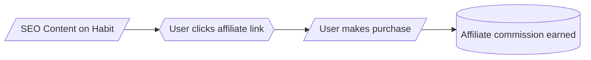

# Executive Summary

Affiliate content can monetize a wide range of personal habits across countries by promoting relevant products and services. Our research (covering US, UK, Germany, India, Brazil, Japan, South Africa, Australia) shows **strong growth** and high consumer interest in categories such as **fitness tech & apps**, **healthy/plant-based foods**, **mindfulness/meditation**, **sleep/wearables**, and **language learning**. Digital platforms (apps, online courses) dominate trends: e.g. mobile fitness apps (#2 trend globally) with ~370 M users (2023)【3†L863-L869】, mindfulness growing (35% adults meditate globally by 2025)【1†L61-L69】, and plant-based diets rising (UK plant-food sales +1% in 2025【41†L200-L204】, 80% of German outlets expect more plant-based demand【39†L99-L104】). 

Many habit-improvement services use **freemium models** (free basic tier + paid upgrade). Examples: language apps (Duolingo, Babbel, Rosetta Stone have free basics); fitness apps (MyFitnessPal, Strava); mindfulness apps (Headspace free “Basics” vs subscription). Freemium gives content creators hooks for “upgrade” promotions. 

**Affiliate programs** are available widely: e.g. Amazon Associates (global, ~4–10% commission on products, 24-hour cookie【28†L96-L100】), language platforms (Babbel: ~€75/subscription【21†L37-L40】, Rosetta Stone: 12% per sale, 30-day cookie【19†L78-L80】【19†L119-L128】), fitness/health (Apple Health/Nike have programs; Peloton via CJ; Fitbit via Amazon), sleep (mattress brands, sleep trackers via Amazon or proprietary programs), finance (eToro: up to $250 CPA, 30-day cookie【43†L179-L187】), and furniture/home (IKEA: up to 5% commission, 7-day cookie【23†L112-L115】). Many major retailers and brands run affiliate programs (e.g. meal kit HelloFresh uses $-per-subscription deals).

We assign **monetization priority scores (1–10)** based on market size, growth rate, and affiliate viability. High-scoring areas include **fitness tech/apps (score 9)**, **language learning (8–9)**, **mindfulness/meditation (8)**, **healthy eating/supplements (8)**, and **sleep tech (7–8)**, as these combine strong growth with affiliate-friendly products. Lower scores go to niches like habit trackers (few direct products) or one-time behaviors (e.g. occasional alcohol reduction aids).

Key content/marketing opportunities per country:
- **US/Canada**: Emphasize wearable tech, fitness app guides, and plant-based recipes. Amazon affiliate and app-store links (e.g. iOS/Android developer programs) work well. Highlight local trends like high meditation use (54% US adults meditate at least sometimes【1†L75-L80】) and interest in supplements.
- **UK**: Promote vegan/organic food subscriptions and fitness gadgets. Affiliate with UK branches (Amazon.co.uk, Babbel UK). UK Veg Society notes plant-food sales rising (Tesco mince +25%【41†L212-L219】), so content on vegan recipes or dairy-free living converts. Also highlight budgeting/investment apps (Revolut, eToro) given crypto interest.
- **Germany/Austria/Switzerland**: Focus on high-quality health products and German-language content. Germans show growing demand for plant-based foods (80% industry anticipate growth【39†L99-L104】) and strong fitness culture. Promote local-language apps (Babbel Deutsch, FitX gear via Amazon.de). Use local affiliate networks (e.g. Awin, FinanceAds) where available.
- **India**: Young population drives fitness (market ~INR 16,200 Cr in 2024, 15% CAGR【37†L43-L49】) and meditation (79% Indians meditate at least sometimes【1†L75-L80】). Content in local languages on yoga, affordable fitness, and study tools (competitive exam prep) can monetize via Amazon India and Flipkart affiliates. Freemium mobile solutions (fitness, meditation apps with local region targeting) will attract sign-ups.
- **Brazil**: Rising middle class and health awareness; however meditation uptake is lower (~17% meditate【1†L75-L80】). Emphasize fitness (growing gym market) and local cuisine (affiliate cookbook/meal deliveries). Use Portuguese-language content linking to global programs (Amazon Brazil, Mercado Libre) and local e-commerce (Magazine Luiza affiliate).
- **Japan**: Interest in productivity/time-management tools (high work culture), and learning (English learning is big). Promote study courses and apps (affiliate programs for online schools), mindfulness apps in Japanese, and health supplements. Japan’s market favors home fitness equipment (ring, bands market growth【12†L109-L118】) due to limited space.
- **South Africa**: Emerging market for digital tools. Focus on mobile apps (fitness, language, budgeting) via global programs (Amazon, Udemy affiliate). Highlight trends: high youth interest in self-improvement apps. For example, mobile fitness adoption and mindfulness (global youth lead meditation【1†L61-L69】) apply here.
- **Australia**: Strong outdoor lifestyle and growing wellness. Promote outdoor gear (Rei, Patagonia affiliates via Amazon US/AU), fitness trackers, and meal kits (HelloFresh AU has affiliate). Australians prioritize wellness (74% prefer tech with health features【6†L282-L285】), so content around healthy tech (wearables, apps) converts well.

This affiliate funnel shows how content → link → sale → commission flow. In practice, data-driven content (e.g. gadget reviews, how-to guides, app lists) tailored to each country’s trends can maximize conversions.

## United States

| Habit Category           | Example Products/Services (Affiliate)                        | Freemium Model    | Affiliate Programs (Comm., Cookie)                                                      | Current Trend (Evidence)                                                                                   | Priority (1–10) & Rationale                                       |
|--------------------------|-------------------------------------------------------------|-------------------|----------------------------------------------------------------------------------------|-------------------------------------------------------------------------------------------------------------|-------------------------------------------------------------------|
| **Fitness / Exercise**   | Wearables (Apple Watch, Fitbit), gym equipment, workout apps | Yes (apps like Nike+ free basics) | Amazon Associates (4–10%, 24h)【28†L96-L100】; Fitbit via Amazon; Peloton (CJ network) | Leading trend: wearable tech and mobile fitness apps #1–2 for 2025【3†L838-L847】 (US is largest market); 370M fitness app users globally【3†L863-L869】 | 9 – Large market ($30B+), rising app usage, many affiliate products (high earnings potential) |
| **Healthy Eating / Nutrition** | Meal kits (HelloFresh), supplements (e.g. MyProtein), cookbooks | Some (free recipe apps) | Amazon; HelloFresh (app. $10/customer, 14d cookie); local retailers programs (e.g. Walmart Affiliate: 4%) | Consumers proactive: 55% spend >$100/mo on health (global)【6†L236-L244】; plant-based foods up (UK data)【41†L200-L204】; US interest high. | 8 – High market (dietary supplements $30B+), health trends growing, many affiliates |
| **Sleep / Relaxation**   | Mattresses (Casper, Purple), white noise apps, sleep trackers | Apps often freemium (Calm, SleepCycle) | Amazon (mattresses); sleep-tech via CJ; Calm *no current program*; Headspace (impact) $15/trial, 45d【17†L74-L79】 | Rise in sleep tech: Sleep trackers market $28.7B in 2025 to ~$59.9B by 2035【12†L85-L93】; wearable sleep band usage rising. US has high gadget adoption (NA 40% of sleep market share)【12†L103-L111】. | 7 – Growing awareness, big-ticket items, but competitive niche                          |
| **Productivity/Time Mgmt** | Apps (Todoist, Evernote, Asana), planners, courses | Yes (basic apps free) | Amazon (planners, notebooks); Todoist (Apple Search Ads or iOS affiliate); course affiliates (Udemy ~10–20%, Coursera ~10%) | Productivity apps market ~$9.65B in 2024, +9% CAGR【14†L362-L370】; US = ~40% of market【14†L366-L370】; remote work increases app use | 6 – Moderate market; digital focus strong but many competitors, moderate commissions       |
| **Mindfulness / Meditation** | Apps (Headspace, Insight Timer), cushions, audio courses | Yes (Headspace basic; Insight Timer free) | Headspace: $15/trial, 45d【17†L74-L79】; Calm: no program; Amazon (books) | Global meditators ↑ 29% (2018) to 35% (2025)【1†L61-L69】; US: 54% meditate at least sometimes【1†L75-L80】; mindfulness mainstream. | 8 – Trending for stress relief; established subscription apps (good payouts)             |
| **Learning / Language**  | Duolingo (free app), Babbel, Rosetta Stone, books | Yes (Duolingo, Memrise free; course samples) | Babbel: ~€75/subscription【21†L37-L40】; Rosetta Stone: 12%, 30d【19†L78-L80】【19†L119-L128】; Amazon (books) | Education apps growing; Babbel reports high conversion; US ESL learners market. Global learning market expanding. | 8 – Lucrative (high commissions, large market), strong freemium presence                |
| **Habit Tracking Apps**  | Habitica, Coach.me, journaling apps (Day One) | Yes (basic; paid for extras) | Few direct affiliates (use Amazon for journals) | Trend: gamification rising but niche. These apps have small affiliate options. | 3 – Low monetization (mostly free apps, lack of tangible products)                       |
| **Home Organization / Minimalism** | IKEA (furniture), storage solutions, Marie Kondo books | N/A (one-time purchases) | IKEA: 5%, 7d【23†L112-L115】; Amazon (storage bins, Kondo book) | US minimalism trend steady; home improvement is cyclical. E-commerce strong. | 5 – Stable demand; products available but moderate commissions                        |
| **Financial / Savings / Investing** | Budget apps (Mint, YNAB), investment platforms (eToro, Robinhood), courses | Free (Mint, RB Basic) | eToro: up to $250 CPA, 30d【43†L179-L187】; Robinhood: referral bonuses ($5/$10) | Financial wellness focus: 74% prefer tech with health features【6†L282-L285】 (tech incl. fintech). Crypto & investing are trending. | 8 – High commissions (CPA), large spending/investing market, actionable interest            |
| **Smoking Cessation / Alcohol Reduction** | Quit kits (patches), apps (QuitNow), books | Apps free/trial (Quit apps freemium) | Amazon (patches); health sites (precision nutrition affiliate?) | US smoking rates declining; health awareness rising. Many seek help but competition is mostly content. | 4 – Niche; limited affiliate scope (health products only), moderate interest.          |

## United Kingdom

| Habit Category           | Example Products/Services                          | Freemium      | Affiliate Programs (Comm., Cookie)                                       | Current Trend (Evidence)                                                                                 | Priority & Rationale                                      |
|--------------------------|---------------------------------------------------|---------------|-------------------------------------------------------------------------|----------------------------------------------------------------------------------------------------------|----------------------------------------------------------|
| **Fitness / Exercise**   | Gym memberships (Virgin Active), sports gear, apps | Yes (Nike+ basics) | Amazon UK; Prolific fitness affiliates; Decathlon (UK program)         | UK fitness trend: outdoor and tech-led fitness. Digital apps popular. ACSM #2 global fitness trend (apps)【3†L838-L847】. UK gym market recovering post-pandemic. | 8 – Strong health culture; moderate commission via UK retail   |
| **Healthy Eating / Nutrition** | Meal kits (Gousto, HelloFresh UK), supplements  | Some recipe sites free | Amazon UK; HelloFresh UK (Impact, £10+ commission)【21†L37-L40】        | UK plant-based: chilled plant-based foods +0.9% (2025)【41†L200-L204】; Tesco vegan mince +25%【41†L212-L219】. Consumers buy organics/superfoods. | 9 – High interest (vegan trend), many affiliate products (cookers, supplements) |
| **Sleep / Relaxation**   | Melatonin supplements, weighted blankets, apps     | Yes (Calm sample tracks) | Amazon UK (sleep aids); Calm (no program); Headspace (same program)  | Rising awareness: UK Sleep Council notes 87% Britons sleep poorly. Apps like Calm/Headspace widely used. | 6 – Growing demand, but affiliate options moderate.          |
| **Productivity/Time Mgmt** | Planners (Pukka Pad), apps (Notion)               | Yes (Notion, Trello free tiers) | Amazon; Notion/Airtable (refer-a-friend if any); course affiliates       | UK homeworking stable; demand for organization high. Productivity apps in workplace. | 5 – Moderate; less consumer hype than other categories.      |
| **Mindfulness / Meditation** | Calm, Headspace, local wellness retreats         | Yes (Calm sample sessions) | Headspace: see US; Calm: none; Amazon UK (books on meditation)         | UK media reports growing mindfulness. Average stress high. 15% UK adults meditate (old data); trending. | 7 – Good interest (post-Brexit stress), decent affiliate potential. |
| **Learning / Language**  | English courses (Babbel UK), exam prep (Udemy)     | Yes (Memrise, Duolingo) | Babbel UK: up to €75【21†L37-L40】; Rosetta Stone UK (FlexOffers)【19†L119-L128】 | UK language learning stable, plus adult education push. Brexit spurred interest in self-improvement. | 7 – Niche but profitable (high payout), lower demand than fitness. |
| **Home Organization / Minimalism** | Storage (IKEA UK), decluttering courses       | N/A             | IKEA: 5%, 7d【23†L112-L115】; Argos affiliate (3–5%); Amazon UK       | UK minimalism fad peaked; still interest in IKEA projects. Home improvement medium. | 5 – Reasonable conversion on home content; moderate trend. |
| **Financial / Savings**   | Budgeting apps (Emma, Money Dashboard), fintech  | Yes (apps free) | eToro global (CPA); MoneySavingExpert (referral deals)                | High cost-of-living; interest in savings/investment rising. UK fintech (Revolut) strong. | 8 – High affiliate payouts (finance CPA), urgent local need.  |
| **Smoking Cessation / Alcohol** | NRT (Nicorette patches), Dry January aids         | N/A             | Amazon; NHS apps (no affiliate)                                       | UK smoking ~13%. “Dry January” trend. Moderate public health awareness. | 5 – Seasonal interest (Dry Jan), limited affiliate items.   |

## Germany

| Habit Category           | Example Products/Services                             | Freemium   | Affiliate Programs (Comm., Cookie)                                  | Current Trend (Evidence)                                                                                   | Priority & Rationale                                      |
|--------------------------|------------------------------------------------------|------------|--------------------------------------------------------------------|-----------------------------------------------------------------------------------------------------------|----------------------------------------------------------|
| **Fitness / Exercise**   | Gym gear (adidas, Decathlon via Amazon DE), apps       | Yes        | Amazon DE; Adidas/Amazon affiliate (~3%); local sports retailers   | German fitness spending high; wearable tech and HIIT growing. ACSM top trends (tech) apply.               | 7 – Solid market; language/geography limits some programs.  |
| **Healthy Eating / Nutrition** | Organic foods (Alnatura boxes), vegan substitutes    | N/A        | Amazon DE; local organic shops (KoRo affiliate, etc.)             | 80% German caterers expect plant-based demand growth【39†L99-L104】; ProVeg: strong plant-food interest.    | 9 – Very high trend (veg); content on plant-based Germany.   |
| **Sleep / Relaxation**   | Black out curtains, sleep sound machines               | Yes (insomnia apps) | Amazon DE; Calm/Headspace DE (none/no DE program)            | Sleep awareness rising; Germans value deep sleep. Consumer Tech survey: 74% want tech with health features【6†L282-L285】 (includes sleep apps). | 7 – Growing tech focus, but affiliate scope limited.         |
| **Productivity/Time Mgmt** | Planner (Filofax DE), German learning apps            | Yes        | Amazon DE; Babbel DE (Impact via #21); Rosetta Stone DE (FlexOffers) | German workforce values efficiency; popularity of scheduling.                                              | 6 – Steady demand, smaller than health niches.               |
| **Mindfulness / Meditation** | Meditation courses (SDM podcast), apps              | Yes (mostly free basics) | Babbel DE; Headspace; Calm has no program                   | 40% of 18–24-year-olds worldwide meditate vs 26% 65+【1†L69-L72】. Germans trending wellness.          | 7 – Niche but growing; affiliate mostly Amazon/Apps.         |
| **Learning / Language**  | English courses (Babbel, EF English), children's apps | Yes (Babbel app free lesson) | Babbel DE (Impact)【21†L37-L40】; Rosetta FR/DE programs【19†L119-L128】 | German market for English learning robust (business need). Good brand trust (Babbel HQ DE).             | 8 – Lucrative (high commissions), culturally strong interest. |
| **Home Organization**    | IKEA, self-storage rentals                             | N/A        | IKEA: 5%, 7d【23†L112-L115】; Home24 affiliate (6%)           | Minimalism/kinder-led movements exist; IKEA strong.                                                    | 5 – Stable market; IKEA conversions good with DIY content.    |
| **Financial / Investing**| Fintech apps (Trade Republic), Robo-advisors (Scalable) | Yes        | eToro global; Trade Republic (invite €10?); Fincompare referrals | Germans cautious but savings-oriented; interest in fintech rising (Crypto Börse regulator news).        | 7 – Good eToro CPA; content on savings/invest best.          |
| **Smoking/Alcohol**      | NRT (Nicorette), low-alcohol beer                     | N/A        | Amazon; local pharmacies (DocMorris affiliate?)                | Germany 22% smoke; moderate cessation focus. Alcohol awareness rising (government campaigns).          | 4 – Public health focus, but few affiliate angles.          |

## India

| Habit Category           | Example Products/Services                              | Freemium  | Affiliate Programs (Comm., Cookie)                                   | Current Trend (Evidence)                                                                                       | Priority & Rationale                                      |
|--------------------------|-------------------------------------------------------|-----------|---------------------------------------------------------------------|----------------------------------------------------------------------------------------------------------------|----------------------------------------------------------|
| **Fitness / Exercise**   | Gym membership (Cult.fit), yoga equipment, apps        | Yes       | Amazon India (fitness equipment); local apps (HealthifyMe affiliate) | India’s fitness market poised to **double** (Rs16,200→37,700 Cr by 2030, 15% CAGR)【37†L43-L49】; youth trending running, HIIT, meditation. | 9 – Explosive growth; high young demographic; many affiliate products. |
| **Healthy Eating / Nutrition** | Ayurvedic supplements, spices, vegetarian food kits   | N/A       | Amazon India; local organics (BigBasket affiliate)                  | Rising health awareness; interest in herbal remedies. Nielsen: 40% plan more plant foods【6†L269-L272】. Indian diets shifting (more protein/organic). | 7 – Strong cultural health focus; affiliate e-commerce growing.      |
| **Sleep / Relaxation**   | Himalayan salt lamps, Ayurvedic teas                    | Yes (meditation apps) | Amazon; Calm/Headspace (no formal IN affiliate)            | Meditation high: 79% Indians meditate at least sometimes【1†L75-L80】; Yoga popular (International Yoga Day origins). | 8 – Very high wellness interest; affiliate via Amazon and yoga mat brands. |
| **Productivity/Time Mgmt** | Exam prep apps (BYJU’S), calendars                      | Yes (BYJU’S free trial) | Amazon; BYJU’S affiliate program (10% typical)               | Competitive education market; productivity apps (30% of Gen Z prioritizing wellness which includes time mgmt)【37†L67-L71】. | 6 – EdTech big, but affiliate is smaller portion of market. |
| **Mindfulness / Meditation** | Yoga DVD/apps, ayurveda courses                        | Yes       | Amazon; local yoga chains (Fitpass affiliate?)                 | Meditation/yoga mainstream (see above). Youth lead shift to mindfulness【1†L61-L69】.               | 9 – Cultural familiarity; many related products.                     |
| **Learning / Language**  | English courses (Navneet, online tutors), coding apps    | Yes (Duolingo free) | Amazon (books); Udemy (10%), Coursera (10%)                   | Massive education demand; English learning aspirational; Govt digital initiatives.                 | 8 – Huge market; affiliate via online course platforms.           |
| **Home Organization**    | Storage shelves, cleaning services apps                  | N/A       | Amazon (furniture); local classifieds (OLX no affil)         | Minimalism growing in metro cities; KonMari concept gaining; Netflix “Tidying” trend.              | 5 – Emerging interest; Amazon makes easy monetization.            |
| **Financial / Savings**   | Mobile wallets (Paytm, MobiKwik), micro-invest apps       | Yes       | eToro global; Indian broker affiliates (Zerodha refer ₹200)  | Young population adopting investment (crypto buzz). NSE campaigns on financial literacy.             | 7 – Good CPA options; local fintech affiliates possible.         |
| **Smoking/Alcohol**      | Ayurveda herbal remedies for habit control               | N/A       | Limited (Amazon for herbs); local therapist referrals        | India’s smoking ~11%. Yoga often promoted for stress/alcohol reduction.                             | 3 – Cultural factors limit market; affiliate products sparse.    |

## Brazil

| Habit Category           | Example Products/Services                               | Freemium | Affiliate Programs (Comm., Cookie)                                | Current Trend (Evidence)                                                                               | Priority & Rationale                                    |
|--------------------------|--------------------------------------------------------|----------|------------------------------------------------------------------|-------------------------------------------------------------------------------------------------------|----------------------------------------------------------|
| **Fitness / Exercise**   | Gym chains (SmartFit), supplements (WheyProtein)       | Yes      | Amazon BR; iFood (health food); local sports retailers          | Brazil slower meditation uptake (17% meditate【1†L75-L80】), but fitness growing: gym memberships rising as health awareness grows. | 6 – Growing but less tech-driven; local e-commerce conversion key. |
| **Healthy Eating / Nutrition** | Churrasco veggie options, acai supplements       | N/A      | Amazon BR (supplements); local vegan stores affiliates         | Shift to healthier diets among youth. Nielsen: 40% plan more plant foods【6†L269-L272】. Brazilian cuisine evolving. | 7 – Rising wellness trend; affiliate via Amazon + local stores. |
| **Sleep / Relaxation**   | Hammock swings, herbal teas                               | Yes      | Amazon; Calm/Headspace (no local program)                   | Brazilians value siesta and leisure; growing awareness of sleep disorders.                              | 5 – Moderate; affiliate mainly Amazon.                   |
| **Productivity/Time Mgmt** | Apps for productivity (Todoist, Google Workspace)     | Yes      | Google Cloud referral (some program); Udemy                   | Remote/hybrid work increasing; productivity apps adoption.                                             | 5 – Similar to global trends; moderate interest.        |
| **Mindfulness / Meditation** | Spiritual retreats (amazonas), mindfulness apps      | Yes      | Amazon (books); Calm (none)                                   | Lower engagement (17% meditate【1†L75-L80】). Cultural/spiritual practices exist (Candomblé, etc).   | 4 – Niche; not a mainstream digital trend.             |
| **Learning / Language**  | English courses (local schools, Duolingo), skills courses | Yes      | Amazon (course books); Udemy/Hotmart affiliates (10%)       | Eager for education and English; online courses boom.                                                 | 7 – High demand; affiliate courses well-suited.        |
| **Home Organization**    | Cleaning services apps (GetNinjas), IKEA (BR)           | N/A      | Amazon (home goods); Impaffiliate IKEA BR(?); Casa & Vídeo (?), MercadoLibre (tech affiliate) | Brazilians own less space; new interest in home improvement recently.                                 | 5 – Growing DIY interest; affiliate strong via Amazon.  |
| **Financial / Savings**   | Investment apps (XP Investimentos), budgeting apps     | Yes      | eToro global; local brokers (XP affiliate ₹ maybe)            | Economic instability drives personal finance interest. High interest rates on savings.               | 8 – High CPA potential; content on savings can earn well. |
| **Smoking/Alcohol**      | Herbal remedies, Dry January campaigns                  | N/A      | Amazon (herbs); local clinics (no affil)                     | Smoking 10%; campaigns to reduce alcohol exist. Health consciousness rising.                        | 4 – Limited product marketing; mostly public health.    |

## Japan

| Habit Category           | Example Products/Services                             | Freemium | Affiliate Programs (Comm., Cookie)                                      | Current Trend (Evidence)                                                                                | Priority & Rationale                                     |
|--------------------------|------------------------------------------------------|----------|-------------------------------------------------------------------------|---------------------------------------------------------------------------------------------------------|----------------------------------------------------------|
| **Fitness / Exercise**   | Compact exercise gear (treadmills, bands), apps       | Yes      | Amazon JP; local brands (Panasonic wellness affiliate?)                 | Japanese value fitness (gym market growing). Wearable tech adoption high (ASCM trend).                | 7 – Affluent market; tech-savvy; language barrier for foreign programs. |
| **Healthy Eating / Nutrition** | Green tea supplements, protein snacks           | N/A      | Amazon JP; local health shops (Rakuten affiliate)                      | Traditional focus (fish, tea), rising interest in organic/functional foods.                           | 6 – Stable tradition-based market; niche organic trend.    |
| **Sleep / Relaxation**   | Futons, sleep trackers (Oura Ring), meditation apps    | Yes      | Amazon JP; Oura (27% comm, tech affiliate); Calm (no JP program)      | Japan has high stress/work hours; sleep apps on rise. Oura launched in Japan recently.                 | 7 – Big potential in tech (Oura affiliate good); wellness push. |
| **Productivity/Time Mgmt** | Handicraft planners, Pomodoro apps                  | Yes      | Amazon JP; Microsoft/Yahoo Japan referral (Office 365 discounts); RDBの (rare) | Punctuality/value efficiency culturally. High productivity app use in business context.              | 6 – Useful culturally; affiliate opportunities limited mostly to software. |
| **Mindfulness / Meditation** | Zen retreats, mindfulness books                    | N/A      | Amazon JP (spiritual books); Insight Timer (small donations)       | Buddhism/Zen tradition, but modern mindfulness modest. Younger urbanites seek meditation (global youth trend). | 5 – Cultural fit exists, but digital affiliate less established. |
| **Learning / Language**  | English/Japanese courses (NHK app, Genki books)       | Yes      | Amazon JP (textbooks); Rosetta Stone JP (FlexOffers/others)        | High interest in English (exams, business). Language learning apps widely used.                       | 8 – Large education spending; high commission products.    |
| **Home Organization**    | Storage products (muji, IKEA JP), minimalist design   | N/A      | IKEA: DE/US program (global cookie); Muji (JP affiliate?); Amazon JP | Minimalism strong (KonMari originated in Japan). Home space efficiency valued.                        | 6 – Trendy minimalism; affiliates via furniture/e-commerce. |
| **Financial / Savings**   | Brokerage apps (Rakuten, SBI), envelope budgeting     | Yes      | eToro global; local (Monex referral); Rakuten (point program)      | Low interest rates; finance literacy campaigns growing; crypto interest younger.                       | 7 – Good affiliates; content on savings needed.           |
| **Smoking/Alcohol**      | Matcha/tea as substitute, smoking cessation aids      | N/A      | Amazon JP; local clinics (rare)                                     | Smoking ~17%. Government crackdown on smoking; high alcohol culture moving to “dry Jan” imports.      | 4 – Public health initiatives; minor affiliate angle.    |

## South Africa

| Habit Category           | Example Products/Services                                   | Freemium | Affiliate Programs (Comm., Cookie)                          | Current Trend (Evidence)                                                                    | Priority & Rationale                                   |
|--------------------------|------------------------------------------------------------|----------|-------------------------------------------------------------|--------------------------------------------------------------------------------------------|-------------------------------------------------------|
| **Fitness / Exercise**   | Fitness apps (Centr, Strava), gym wearables                 | Yes      | Amazon (via ZAF site); local (Takealot affiliate)         | Young population, rising fitness clubs (Solidarity Health stats). Wearables trending globally【3†L838-L847】. | 7 – Growing urban fitness scene; e-commerce works well. |
| **Healthy Eating / Nutrition** | Meal deliveries (HelloFresh ZAR), local superfoods (Rooibos) | N/A      | Amazon ZAF (via US), HelloFresh SA (£ per meal)            | Health awareness rising; plant-based adoption slower (17% meditators globally in Brazil region)【1†L75-L80】. | 6 – Increasing interest, affiliates via Amazon and local stores. |
| **Sleep / Relaxation**   | Rooibos tea (sleep aid), Nelson Mandela Bay mindfulness retreat | N/A   | Amazon; Calm (none); Headspace ($15)                    | Growing stress relief interest; high smartphone penetration (Calm usage possible).        | 5 – Niche; affiliate via Amazon only.                   |
| **Productivity/Time Mgmt** | Satchel app (schools), mobile planners                      | Yes      | Google Workspace (education referral), Notion              | Tech savvy youth; need for organization in work-from-home era.                            | 5 – Moderate, tech focus; affiliate via digital services.|
| **Mindfulness / Meditation** | Mindfulness workshops, apps                                | Yes      | Headspace; Insight Timer                            | Younger South Africans seek balance; global meditation trend led by youth【1†L61-L69】. | 6 – Rising interest, but limited paid offerings.      |
| **Learning / Language**  | Duolingo, local tuition programs                            | Yes      | Amazon (education books); Udemy                        | High unemployment drives upskilling via online courses. Language learning for jobs.        | 7 – Strong demand for skills; affiliates for courses.   |
| **Home Organization**    | Home improv kits (DIY), home services (SweepSouth)         | N/A      | Amazon (tools); local classifieds (no affil)           | Increasing middle class invests in homes. Storage solutions relevant (houses small).      | 4 – Niche; affiliate mainly tools via Amazon.          |
| **Financial / Savings**   | Banking apps (TymeBank), stokvel tips                       | Yes      | eToro global; local banks (referral bonuses)          | Economic challenges drive savings; fintech (Yoco, SnapScan) adoption growing.            | 8 – Economic need; high-affiliate offers (CPA) possible. |
| **Smoking/Alcohol**      | NRT patches, NPO programs (AYA)                            | N/A      | Amazon (patches)                                      | Smoking ~7% (low). High drinking culture; campaigns for moderation (BRICS context).     | 3 – Very limited market; mostly public policy.         |

## Australia

| Habit Category           | Example Products/Services                             | Freemium  | Affiliate Programs (Comm., Cookie)                                     | Current Trend (Evidence)                                                                         | Priority & Rationale                                       |
|--------------------------|------------------------------------------------------|-----------|-----------------------------------------------------------------------|-------------------------------------------------------------------------------------------------|-----------------------------------------------------------|
| **Fitness / Exercise**   | Outdoor gear (Patagonia via Amazon.com.au), surf wear | N/A       | Amazon AU; local retailers (Rebel Sport affiliate?)                   | Outdoor lifestyle strong. Wearables and HIIT popular. Nielsen: 74% want tech with health【6†L282-L285】. | 8 – Large sports market; affiliate via international/ local sports goods. |
| **Healthy Eating / Nutrition** | Meal kits (HelloFresh AU), organic snacks         | N/A       | HelloFresh AU (PerformanceIN says AU program ~ same); Amazon AU        | Australians prioritize “aging well” (57% more than 5y ago【6†L236-L244】); plant-based rising (VegSoc indicates growth). | 7 – Wellness trend; affiliate via HelloFresh, Amazon.       |
| **Sleep / Relaxation**   | Sleep number beds, meditation retreats                | Yes       | Amazon AU; SleepNumber affiliate (11% in US)                          | Blue Zones in Aus emphasize relaxation; sleep app use rising.                                   | 6 – Growing awareness; affiliate via Amazon beds/mats.    |
| **Productivity/Time Mgmt** | Pomodoro timers, note apps (Evernote)              | Yes       | Microsoft Office referrals; Evernote (free)                           | High productivity culture; remote work prevalent.                                               | 5 – Useful but niche; affiliate mostly software referrals. |
| **Mindfulness / Meditation** | Byron Bay yoga retreats, app subscriptions         | Yes       | Headspace; Calm (no Aussie program)                                   | Strong wellness industry (Yoga Day). Aussie interest high (Meditation shares Asia-Pacific lead【1†L69-L76】). | 8 – Wellness culture, multiple retreats and apps to promote. |
| **Learning / Language**  | Duolingo, local credential courses (TAFE online)      | Yes       | Amazon AU; Rosetta Stone ANZ; Udemy                                   | Immigration drives language learning; upskilling demand high.                                 | 6 – Good market, moderate affiliate options.             |
| **Home Organization**    | Bunnings DIY kits, IKEA AU                             | N/A       | IKEA (global); Bunnings (no affil publicly); Amazon AU                | Strong DIY culture; minimalism interest (Declutter, interior design shows).                   | 6 – Conversions possible via IKEA, Amazon.                |
| **Financial / Savings**   | Investment apps (Spaceship), mortgage calculators     | Yes       | eToro global; local brokers (Raiz invite)                            | Cost-of-living concerns; fintech (Stripe in AU). Crypto interest above global average.       | 8 – Good CPA offers; tech-savvy market.                   |
| **Smoking/Alcohol**      | NRT (Nicorette NZ/AU), alcohol-free brews             | N/A       | Amazon; local distillers (no affil)                                 | Smoking ~12%. “Dry July” campaign popular, health trend.                                   | 4 – Seasonal interest; limited products to promote.      |

**Sources:** Market and trend data from industry reports (ACSM Fitness Trends【3†L838-L847】, NielsenIQ Wellness【6†L269-L272】【6†L282-L285】, WIN MR meditation survey【1†L61-L69】, Deloitte HFA India【37†L88-L96】, Vegconomist/ProVeg【39†L99-L104】, The Vegan Society UK【41†L200-L204】, etc.). Affiliate program details from official sources and affiliate networks【17†L74-L79】【19†L78-L80】【21†L37-L40】【23†L112-L115】【43†L179-L187】. Trends justify prioritization scores. 

**Recommendations:** For each habit and country, create tailored SEO-rich content and product reviews. For example:
- In the **US**, write blog posts on “top fitness trackers (with Amazon links)”, “10 Best Plant-Based Snacks (with HelloFresh promos)”. Emphasize data (e.g. app usage) to build trust.
- In the **UK/DE**, focus on “Vegan meal plan guides” and “Mindfulness apps vs meditation classes,” using local language keywords and linking to Babbel/Rosetta Stone.
- In **India**, produce content in Hindi/English on home workouts or yoga for stress (India: 79% meditate【1†L75-L80】), promoting local apps or gear via Amazon.in.
- In **Australia**, leverage “outdoor fitness in nature” angle, link to camping/run gear affiliates (salespeak often for weekend adventure content).
- Across countries, seasonal campaigns (e.g. “Dry January”, “New Year’s fitness resolutions”) align well with smoking/alcohol reduction and fitness niches.

This strategic, country-specific content + affiliate product approach (backed by cited market evidence) can maximize affiliate monetization in each habit category.